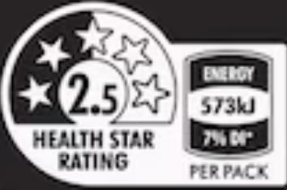

# SEA SALT & BALSAMIC VINEGAR FLAVOURED POTATO CHIPS

# Ingredients:

POTATOES (71%), CANOLA OIL, NATURAL

FLAVOURS, SUGAR, SALT, MALTODEXTRIN, FOOD

ACID (CITRIC ACID), YEAST EXTRACT, ONION

POWDER, NATURAL COLOUR (PAPRIKA EXTRACT),

BALSAMIC VINEGAR POWDER, SUNFLOWER OIL,

ANTIOXIDANTS (TOCOPHEROLS, ASCORBIC ACID,

ROSEMARY EXTRACT).

CONTAINS MILK, SOY.

NUTRITIONAL INFORMATION

SERVINGS PER BOX:2

<table><tr><td>ENERGY</td><td>573 kJ (137 Cal)</td><td>7%</td><td>2050 kJ (489 Cal)</td></tr><tr><td>PROTEIN, TOTAL</td><td>2.1g</td><td>4%</td><td>7.6g</td></tr><tr><td>-GLUTEN</td><td>NOT DETECTED</td><td></td><td>NOT DETECTED</td></tr><tr><td>FAT, TOTAL</td><td>6.7g</td><td>10%</td><td>23.8g</td></tr><tr><td>-SATURATED</td><td>0.5g</td><td>2%</td><td>1.6g</td></tr><tr><td>-TRANS</td><td>0.1g</td><td></td><td>0.2g</td></tr><tr><td>-POLYUNSATURATED</td><td>2.1g</td><td></td><td>7.3g</td></tr><tr><td>-MONOUNSATURATED</td><td>4.0g</td><td></td><td>14.2g</td></tr><tr><td>CARBOHYDRATE</td><td>16.3g</td><td>5%</td><td>58.4g</td></tr><tr><td>-SUGARS</td><td>0.7g</td><td>1%</td><td>2.7g</td></tr><tr><td>SODIUM</td><td>205 mg</td><td>9%</td><td>731 mg</td></tr><tr><td>POTASSIUM</td><td>429 mg</td><td></td><td>1530 mg</td></tr></table>