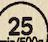
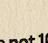

# THE BIG PICTURE

AT MACRO, WE BELIEVE THAT WE CAN MAKE BETTER CHOICES EVERY DAY.
RAISED WITHOUT ANTIBIOTICS, OUR
CHOOKS FORAGE AND SOCIALISE
OUTDOORS, WITH SAFE SHELTER
PROVIDED ALL YEAR ROUND.

**COOKING INSTRUCTIONS**

Product must be fully cooked before eating.

Cooking times are a guide and may vary depending on your appliance.

**Oven**

1 Preheat Conventional Oven to 190°C (Fan Forced 180°C).

2 Remove Chicken from packaging.

3 Place Chicken on baking tray and roast for 20-25 minutes per 500g or until cooked through.

Fan 180°C

**25** min/500g

If you're not 100% happy with your purchase,we'll replace or refund.

**STORAGE INSTRUCTIONS**Keep refrigerated at 1-5°C.

Packed for Woolworths1 Woolworths Way, Bella Vista NSW 2153, AustraliaFor more information free call: 1800 103 515.www.woolworths.com.au 01865001