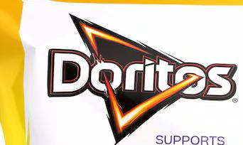

  

SUPPORTS  

# REACHOUT  

Doritos believes it's good to talk.  

Almost 40% of young people have difficulty with their mental health; starting to talk about what's going on for you is the first bold move towards (feeling better).  

That's why Doritos supports ReachOut.  

ReachOut helps (young people) (and their parents) feel better by providing a (safe place) where they can openly express themselves, explore what's happening in their lives, and connect with people who understand their situation.  

Since 2022, Doritos has helped more than 200,000 people take action for their mental health as part of its partnership with ReachOut.  

Lost your crunch?  

Be bold. ReachOut.  

National Study of Mental Health and Wellbeing, 5/10/2023  

  

# DORITOS NACHO CHEESE FLAVOURED CORN CHIPS  

# INGREDIENTS  

CORN (69%), CANOLA OIL, MALTODEXTRIN, WHEY POWDER (MILK), SALT, DEXTROSE, SUGAR, MINERAL SALT (POTASSIUM CHLORIDE), CREAM POWDER (MILK), SPICES (CHILLI, BLACK PEPPER, GREEN BELL PEPPER, CUMIN), TOMATO POWDER, VEGETABLE FAT POWDER (MILK, SOY), FLAVOURS (MILK), FOOD ACIDS (SODIUM DIACETATE, CITRIC ACID, LACTIC ACID), ONION POWDER, YEAST EXTRACT, NATURAL COLOURS (PAPRIKA EXTRACT, ANIATTO), HERB (PARSLEY), SUNFLOWER OIL, ANTIOXIDANTS (TOCOPHEROLS, ASCORBIC ACID, ROSEMARY EXTRACT). Contains Gluten, Milk, Soy.  

# NUTRITION INFORMATION  

SERVINGS PER PACKAGE: 6.3 SERVING SIZE: 27g (About 11 chips)  

<table><tr><td></td><td>Average Quantity per Serving</td><td>% Daily Intake* per Serving</td><td>Average Quantity per 100g</td></tr><tr><td>ENERGY</td><td>591 kJ</td><td>7%</td><td>2190 kJ</td></tr><tr><td>PROTEIN</td><td>2.0 g</td><td>4%</td><td>7.5 g</td></tr><tr><td>FAT, TOTAL</td><td>7.3 g</td><td>10%</td><td>28.8 g</td></tr><tr><td>- SATURATED</td><td>0.8 g</td><td>3%</td><td>3.0 g</td></tr><tr><td>- TRANS</td><td>0.1 g</td><td></td><td>0.3 g</td></tr><tr><td>- POLYUNSATURATED</td><td>2.0 g</td><td></td><td>0.9 g</td></tr><tr><td>- MONOSATURATED</td><td>4.3 g</td><td></td><td>7.8 g</td></tr><tr><td>CARBOHYDRATE</td><td>16.2 g</td><td>5%</td><td>16.0 g</td></tr><tr><td>- SUGARS</td><td>0.9 g</td><td>1%</td><td>60.2 g</td></tr><tr><td>DIETARY FIBRE</td><td>1.4 g</td><td>5%</td><td>3.1 g</td></tr><tr><td>SODIUM</td><td>97 mg</td><td>4%</td><td>5.1 g</td></tr><tr><td>POTASSIUM</td><td>122 mg</td><td>452 mg</td><td></td></tr></table>

\\*Percentage Daily Intakes are based on an average adult diet of 8700kJ. Your daily intakes may be higher or lower depending on your energy needs.  

AVERAGE VALUES SUBJECT TO SEASONAL VARIATION  

## CONSUMER ENQUIRIES  

AUST.1800 025 789  

www.smiths.com.au THE SMITHS SNACKFOOD COMPANY PTY LTD, 799 PACIFIC HIGHWAY, CHATSWOOD, NSW 2067  

N.Z.0800 730 123  

www.bluebird.co.nz BLUEBIRD FOODS LIMITED, 154 WILSTATION ROAD, MANUKA, AUCKLAND 2104  

MADE IN AUSTRALIA  

REGISTERED TRADEMARK  

OF THE PERSICO GROUP OF  

COMPANIES, USED IN AUSTRALIA  

AND NEW ZEALAND UNDER LICENSE.  

  

PDCC356128  

  

9 310015 241918  

  

4200053841