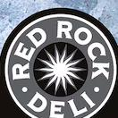
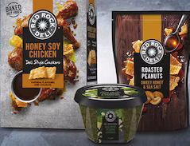

  

We begin with the finest potatoes harvested from Australian farms,  

roughly cut and slow- cooked in  

Sunflower Oil, for the most delectable crunch. With surprising twists, grinds and blends of carefully selected flavours, there's an enticing taste journey waiting to be discovered in every bite.  

Our Sea Salt & Balsamic Vinegar potato chips blend a grind of sea salt with a generous splash of the sweet sharpness of balsamic vinegar.  

Why not try our other Deli Style products?  

  

# RED ROCK DELI® SEA SALT & BALSAMIC VINEGAR FLAVOURED POTATO CHIPS  

Ingredients: POTATOES, SUNFLOWER OIL, NATURAL FLAVOURS, SUGAR, SALT, MACADEOXTRIN, FOOD ACID CITRIC ACID), TASTY EXTRACT, ONION POWDER, NATURAL COLOUR (PAPRIKA EXTRACT), BALSAMIC VINEGAR POWDER. Contains Milk or Milk Products. Contains Soybeans or Soybean Products.  

<table><tr><td colspan="4">NUTRITIONAL INFORMATION</td></tr><tr><td colspan="4">SERVINGS PER PACKAGE: 5.2</td></tr><tr><td colspan="4">SERVING SIZE: 28g (About 18 Chips)</td></tr><tr><td>ENERGY</td><td>Average Quantity per Serving</td><td>% Daily Intake*</td><td>Average Quantity per 100g</td></tr><tr><td>PROTEIN</td><td>2.19</td><td>7%</td><td>200.9</td></tr><tr><td>GUTT</td><td>MOT DECIDED</td><td></td><td>7.6g</td></tr><tr><td>FAT</td><td>0.74</td><td>19%</td><td>23.6g</td></tr><tr><td>Saturated</td><td>0.5</td><td>2%</td><td>1.9g</td></tr><tr><td>FIBER</td><td>0.6</td><td></td><td>0.1g</td></tr><tr><td>POLYSACCHARIDATE</td><td>0.6</td><td></td><td>2.3g</td></tr><tr><td>MONOSACCHARIDATE</td><td>0.6</td><td></td><td>19.2g</td></tr><tr><td>GLUCOSAMYLASE</td><td>0.5</td><td></td><td>58.4g</td></tr><tr><td>SODIUM</td><td>0.7</td><td>5%</td><td>7.1g</td></tr><tr><td>POTASSIUM</td><td>205 mg</td><td></td><td>731 mg</td></tr><tr><td>POTASSIUM</td><td>435 mg</td><td></td><td>1530 mg</td></tr></table>  

AVERAGE VALUES SUBJECT TO SESAMAL VARIATION \*Percentage Daily Intakes are based on an average adult diet of 8700kJ. Your daily intakes may be higher or lower depending on your energy needs.  

## GLUTEN FREE  

Contact The Red Rock Deli Chip Company on:  

1800 500 502 (Aust)  

0800 730 123 (NZ)  

We'd love to hear from you.  

Or visit us at www.redrockdeli.com.au  

The Red Rock Deli Chip Company  

533- 567 South Road, Regency Park,  

South Australia 5010, Australia.  

Made in Australia.  

Distributed in New Zealand by  

Bluebird Foods Limited,  

124 Wilt Station Rd, Manukau,  

Auckland 2104, New Zealand.  

  

Store Drop Off  

PDPC407318  

  

420038266